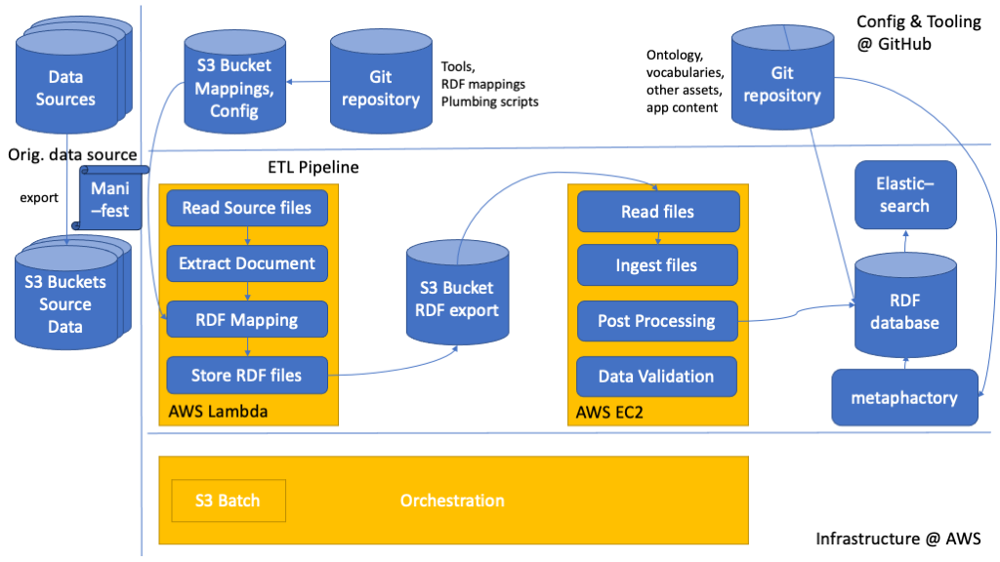

# metaphacts ETL pipeline

The ETL pipeline provides a means to convert structured data to RDF, ingest it into a database and perform post-processing steps.

It is based on an opinionated selection of components and tools:

* AWS as cloud environment with a selection of services such as S3, CloudFormation, StepFunctions, Lambda, EC2, etc. for various parts
* [RML](https://rml.io/) as declarative mapping language with [Carml](https://github.com/carml/carml) as mapping engine
* [GraphDB](https://graphdb.ontotext.com/) as RDF database

## Features

The ETL pipeline has the following features:

* read source files from a S3 bucket
* convert source files to RDF using [RML](https://rml.io/) mappings
* supported formats are CSV, XML, JSON, JSONL, also in compressed (gzipped) form
* the RDF files are again written to an S3 bucket, one RDF file per source file
* the RDF files are ingested into a graph using the [GraphDB Preload tool](https://graphdb.ontotext.com/documentation/10.2/loading-data-using-importrdf.html#load-vs-preload)
* adding new files into the source bucket after the initial ingestion will add them as incremental updates

See [ETL Pipeline Setup](etl-pipeline/README.md) for how to set up the pipeline.

## Architecture

The following diagram shows the architecture of the ETL pipeline:

## Copyright

All content in this repository is (c) 2023 by metaphacts.