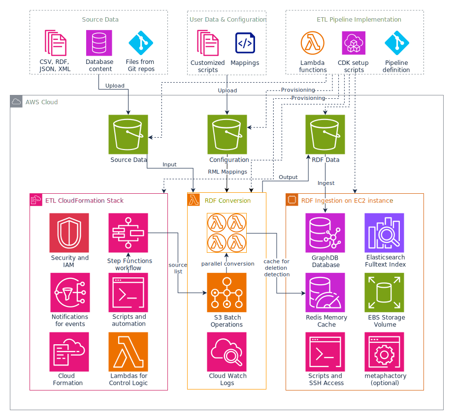

# Architecture of the ETL Pipeline

The following diagram shows the architecture of the ETL pipeline:

The pipeline uses a multitude of AWS services to implement the RDF conversion and ingestion process with a cloud-native approach resulting in high parallelization and efficient use of resources.

The following services are used:

*  [Cloud Formation](https://aws.amazon.com/cloudformation/) and the [Cloud Development Kit (CDK)](https://aws.amazon.com/cdk/) to set up the pipeline and provision all resources
*  [Simple Storage Service (S3)](https://aws.amazon.com/pm/serv-s3/) to store input files, configuration, output files and [S3 Batch Operations](https://aws.amazon.com/s3/features/batch-operations/) to perform conversion of source data to RDF.
*  [Lambda](https://aws.amazon.com/pm/lambda/) for the RDF conversion and various control logic.
*  [Step Functions](https://aws.amazon.com/step-functions/) to orchestrate the overall pipeline operation. The workflow is described below.
*  [Elastic Compute Cloud (EC2)](https://aws.amazon.com/pm/ec2/) with [Elastic Block Storage (EBS)](https://aws.amazon.com/ebs/) to run the ingestion of RDF data into the RDF database including a full-text search index.
*  [Simple Notification Service (SNS)](https://aws.amazon.com/sns/) to send notifications for pipeline events to listeners, e.g. to an email address.
*  [Identity and Access Management (IAM)](https://aws.amazon.com/iam/) to create policies and roles to grant the permissions required to access services and resources.

Configuration files and the user-provided RML mapping files are stored in a S3 bucket, making them easily accessible from all AWS services. Similarly, the source files to be converted and ingested are expected in a S3 bucket. The output of the RDF conversion is also stored in another S3 bucket. This allows to keep the RDF version of the source data and use or distribute them independently from the data in the RDF database.

## When To Use

The pipeline follows the _Materialization_ approach described in the [Concepts](Concepts.md). It can be used whenever a knowledge graph should be created from highly connected source data. 

Source data is converted to RDF from any of the supported source formats.

When integrating data from databases or other non-file based sources, the relevant set of records needs to be exported and partitioned into manageable pieces (files) upfront. This step keeps the highly domain- and source-specific export and slicing of source data outside of the pipeline, as this is difficult to implement in a generic way. An examples for such a step is exporting a big table from a relational database to a set of files with a fixed number of records per file.

In many cases, data is not ingested only once, but needs to be kept up to date with frequent updates from the original data sources. The ETL pipeline supports this be either re-creating the graph from scratch for a new generation or by updating it in-place to apply incremental changes.

Creating a graph from scratch is the safest approach, but might impose some performance overhead for re-running the full RDF conversion and ingestion even for data that was already processed before. This works well for frequently changing data or complex data models, which are difficult to update in-place.

Applying incremental updates highly depends on the domain model, as the changing parts need to be identified and replaced. Due to the nature of the RDF data model this requires deleting obsolete data before adding new information. This works well for infrequent or low-volume changes or when the data to be deleted can be easily identified, e.g. a whole named graph or all outgoing edges of an entity.

## Pipeline Workflow

The RDF conversion and ingestion process is implemented using a AWS Step Functions workflow. The workflow consists of a number of steps to orchestrate the involved services and applies scripting for some tasks running on the companion EC2 virtual machine instance. Some steps required additional control logic, e.g. to select source files based on criteria like naming patterns or a timestamp. This control logic is handled by additional lambda functions, which also allows for customization by overriding the provided default implementations.

The high-level workflow consists of the following steps:

*  select the source files to be processed.
*  create a manifest for those files and pass them to S3 Batch Operations for RDF conversion.
*  S3 Batch Operations passes the files in small batches to a lambda function for RDF conversion. The service easily scales to thousands of files. It tracks progress and state, and also takes care of retrying failed conversions to compensate for spurious errors.

    Depending on the number of input files, the lambda function is scaled up to perform the RDF conversion in parallel. With the default quotas of an AWS account, this may go up to 1000 concurrent lambda instances.

    Note: this is a long-running process which may last a few hours.
*  the RDF conversion lambda converts a source file to RDF data:
    *  read the mapping configuration and all referenced mapping files from the S3 bucket containing the configuration information.
    *  receive a list of source files to process from S3 Batch Operations.
    *  read each source file from the S3 bucket containing source files.
    *  determine the RML mappings to be applied by matching the file name to a list of mapping definitions. The mapping configuration may also include additional processing hints for pre- or post-processing on a per-file level.
    *  convert source file to RDF. Supported source formats are CSV, XML, JSON, JSONL, also in compressed (gzipped) form.
    *  the RDF files are written to an S3 bucket, one RDF file per source file.
*  when all source files have been converted to RDF, a notification is sent to via SNS.
*  the ingestion process is triggered on the companion EC2 instance:
    *  the ingestion is prepared by creating an empty database deployment.
    *  the RDF database will store all data on an Elastic Block Storage (EBS) volume. This volume can also be detached, moved, archived, or cloned and allows a very flexible use of the fully ingested database.
    *  the RDF files are downloaded from the S3 bucket containing the RDF files from the conversion step.
    *  the [GraphDB Preload](https://graphdb.ontotext.com/documentation/10.4/loading-data-using-importrdf.html#load-vs-preload) tool is launched in offline mode to ingest the RDF files.
    
        Note: this is a long-running process which may last many hours.
    *  once the full ingestion is completed, a notification is sent via SNS.
    *  the GraphDB database is launched.
    *  additional services like Elasticsearch and optionally metaphactory are also launched.
    *  a full-text search index is created.
    
        Note: this is a long-running process which may last many hours.
    *  once the index creation is completed, a notification is sent via SNS.
*  the database can be used for regular operations
*  when enabled, the pipeline switches to incremental update mode which periodically checks for new data and ingests it into the running database: 
    *  a notification is sent via SNS.
    *  identify new files to be ingested.
    *  perform conversion to RDF as described above.
    *  identify changes from the original data set. This is highly domain-specific.
    
        Note: by default a naive approach is applied, which simply inserts all data into the database and does not detect and delete obsolete data. This can be changed by providing customized scripts in the S3 bucket holding the configuration.
    *  delete obsolete data.
    
        Note: this is done while the database is running. Also, this is a long-running process which may last many hours.
    *  insert new or changed data.
    
        Note: this is done while the database is running. Also, this is a long-running process which may last many hours.
    *  sleep until the next iteration.
    *  a notification is sent via SNS.
