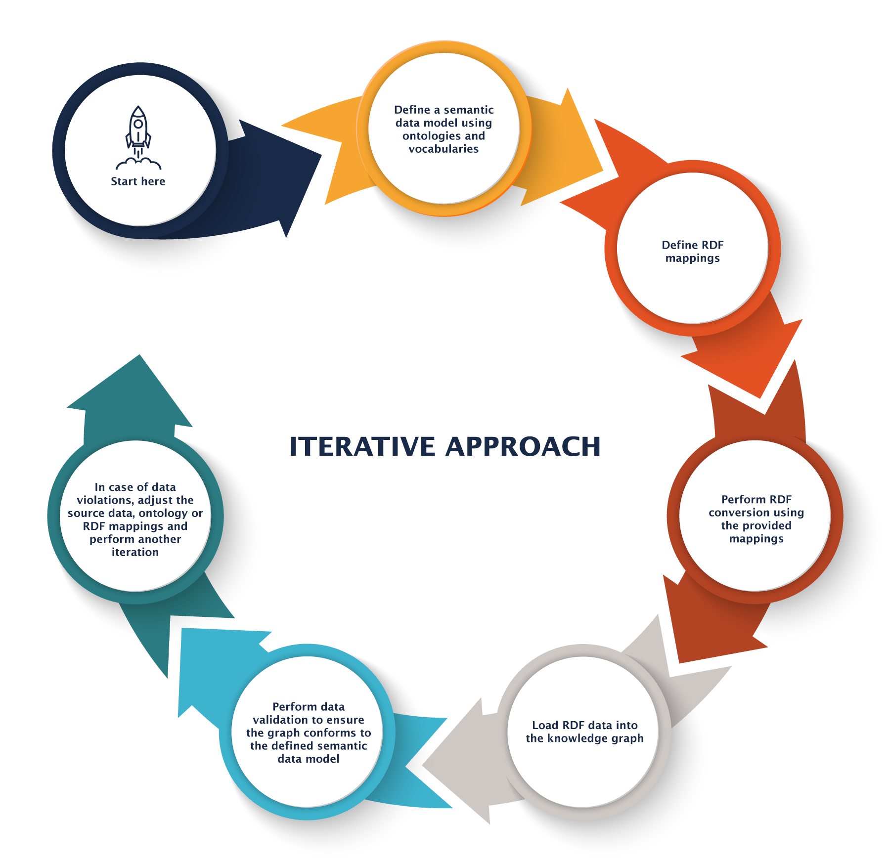

# Concepts for Graph Creation

This document describes an approach for **creating a Knowledge Graph from source data**. It discusses various aspects relevant for knowledge graph creation and finally provides a concrete implementation based on an Extract-Transform-Load (ETL) pipeline consisting of an opinionated set of tools and running in a public cloud environment.

## Source Data

A knowledge graph may be constructed with data from many different sources. When creating a knowledge graph, a few aspects need to be considered regarding the various types, formats, and partitioning of source data.

### Structured vs. Unstructured data

While a knowledge graph may be created from manually created data, e.g. using form-based authoring, in most cases data is imported into the knowledge graph from existing data sources.

Data sources can be divided into two main types: structured data and unstructured data.

Structured data includes machine readable files and formats like JSON, XML, CSV or data obtained from (relational) databases which follow a well-defined syntax and may optionally also have schema information (e.g. relational databases). This kind of data is easy to read and generally accessible using ready-made libraries and parsers.

Unstructured data includes documents like emails, PDF files, images, scanned paper documents, etc. which generally do not make the contained information available in a machine readable format. Reading, parsing, understanding, and converting unstructured data is a difficult task and often approached using machine learning (ML) techniques like Optical Character Recognition (OCR), Name Entity Recognition (NER), text classification, or Entity  Linking (EL) using services or libraries like [SpaCy](https://en.wikipedia.org/wiki/SpaCy).

In this document, only structured data is considered.

### Source Data Formats

Structured data may be provided in files and data streams with many different formats. Examples of widely used formats are:

* CSV/TSV (tabular)
* XML (hierarchical)
* JSON/JSONL  (hierarchical)
* Query results from Relational Databases  (tabular)

Other structured data formats can be used as well, but they might require custom adapters or parsers.

## Graph Data Model

Graphs are represented using the [Resource Description Framework (RDF)](https://www.w3.org/TR/rdf11-concepts/).

Using the Resource Description Framework, a graph is expressed as a set of statements (or triples), each of which describes a single fact, i.e. an attribute of a resource (or edge or node) or a relation between two resources.

[RDF-star](https://www.w3.org/2021/12/rdf-star.html) is an extension of RDF and also supports expressing statements on statements, which allows to model edges with attributes.

Using RDF-star, any graph can be expressed, so RDF-star can also be used as a bridge to and from Labeled Property Graphs (LPG).

## Data Partitioning

Any reasonable real-world dataset is too large to treat as a single unit, so partitioning comes into play to divide data into workable chunks. Data can be partitioned by a number of different criteria:

* source / origin of data
* application domain, i.e. entity types
* licensing
* visibility / security
* size

Which of those criteria are used depends on the overall size and use case.

### Partitioning Source Data

When converting big datasets to RDF, handling the whole dataset in a single operation doesn't work. Breaking data into manageable pieces helps to perform RDF conversion and ingestion in a scalable manner.

This can be done e.g. by breaking down big datasets into individual files. When integrating data from a database, the data should be exported into a set of files with an appropriate amount of data per conversion unit with a maximum size. This moves paging of data and partitioning outside of the conversion process, as that highly depends on the structure and amount of data as well as additional considerations like (de-)normalization, number and size of files to split into, handling the full dataset or just an increment, etc.

### Partitioning Graph Data into Named Graphs

Partitioning the source data is mainly relevant for the RDF conversion. In addition to that, data also needs partitioning within the knowledge graph.

Partitioning graph data is performed by storing sub graphs in so-called named graphs. Each named graph is identified using an IRI which extends the part triple subject-predicate-object with the named graph IRI and hence forms a quadruple.

Each named graph is further described using graph metadata, which includes type, description, license information, etc. See the section on graph metadata below for further details.

Graph data may be split into named graph based on different criteria:

* named graph per data domain (i.e. entity type)
* named graph per source
* a mix of those approaches

Please note that size (amount of data) is not typically considered for data partitioning within a knowledge graph.

The selected partitioning strategy highly depends on the use case and application data.

## Knowledge Graph Creation Approach

Creating a knowledge graph can be approached using different approaches optimized for either performance or loose coupling.

### Materialization

The common approach of knowledge graph creation is to materialize RDF in a graph database. This involves retrieving source data from the original data source, convert it to RDF if required and persist it, e.g. in a graph database.

A fully materialized knowledge graph provides the best performance for querying, as data is stored in a native graph format and within a graph database, which is optimized for graph querying and processing.

Materialization works especially well for highly connected data, exposing relationships from data integrated from multiple sources.

### Virtualization

With virtualization, data resides at its original data store and in its original format, e.g. as tabular data in a relational database. When querying the knowledge graph, data is retrieved from the original data source and the results transformed to RDF on the fly.

This leads to loose coupling as data is only transferred and converted to RDF when requested and does not need to be maintained in two data stores at the same time. This approach is well suited for data which is required only rarely and follows a tabular structure, e.g. time series data or other types of mass data.

As a drawback, query performance is rather low, as data has to be queried from another, external source and transformed on the fly to RDF.

### Federation

Federation is a variant of virtualization: data is already available in RDF format and from a SPARQL endpoint, so the query semantics are the same as querying data from just a single RDF database.

This approach is useful to combine data e.g. from public datasets like [Wikidata](https://www.wikidata.org/) with internal data or from multiple sources.

As data sources can be both internal or external, this allows to combine confidential or sensitive data with public information.
The original data is maintained by their respective owners or stewards, but can be combined in a knowledge graph for specific purposes.

The [SPARQL 1.1 query language](https://www.w3.org/TR/sparql11-query/) provides a built-in feature for expressing information needs over multiple RDF knowledge graphs. Using [SERVICE clauses](https://www.w3.org/TR/sparql11-federated-query/), it is possible to combine information from remote RDF sources with data from the local RDF database.

## Knowledge Graph Creation Process

Creating a knowledge graph involves different tasks and phases.

The following sections describe some aspects to consider for knowledge graph creation.

### FAIR Data Principles

A knowledge graph is only one system within an enterprise environment consisting of interconnected systems. One key aspect in this world of interconnected systems and data is to follow the [FAIR Data principles](https://www.go-fair.org/fair-principles/):

* **F**indable: metadata and data should be easy to find for both humans and computers. Machine-readable metadata is essential for automatic discovery of datasets and services.
* **A**ccessible: using data requires documentation on how it can be accessed, possibly including authentication and authorization.
* **I**nteroperable: data usually needs to be integrated with other data. In addition, data needs to be used with applications or workflows for analysis, storage, and processing.
* **R**eusable: The ultimate goal of FAIR data is to facilitate the reuse of data. To achieve this, metadata and data should be well-described so that they can be replicated and/or combined in different settings.

### Iterative Approach

When creating a knowledge graph from scratch, it is often useful to apply an iterative approach:

* identify source datasets and make them accessible
* define a data model using ontologies and vocabularies
* define RDF mappings to convert from structured source data to RDF
* pre-process source data (per file), e.g. to clean up data
* perform RDF conversion using the provided mappings
* post-process intermediate results (per file), e.g. to create additional relations or aggregate data
* load RDF data into the knowledge graph to persist the data in a graph database
* post-process intermediate results (whole graph), e.g. to create additional relations or aggregate data
* perform data validation to ensure the graph conforms to the defined data model

When violations are observed during data validation, the results can be used as a starting point to improve the pipeline by fixing e.g. source data by performing data cleansing, adjust the ontology or RDF mappings and perform another iteration of the data integration process or ETL pipeline.

### Providing Dataset Metadata

Data catalogs are a core building block for any FAIR data implementation, as they connect the available data assets with the knowledge graph. In this approach, the data catalog is represented as a knowledge graph itself, is semantically described with descriptive metadata and access metadata, is interlinked with other parts of the knowledge graph - such as ontologies and vocabularies, and it is embedded into and connected with data assets, thus providing a unified access layer for the end user, with traceable and explainable connections down to original data sources.

Dataset descriptions (or data catalogs) are based on open and extensible W3C standards (e.g., [DCAT](https://www.w3.org/TR/vocab-dcat-2/)) to make the data discoverable, accessible, and traceable.

Dataset metadata may provide information on several important aspects of a dataset:

* provenance information to describe where data originated from
* lineage information to record previously applied processing steps and how data passed from one step in a data mesh to another
* licensing information to specify whether and how data can be used, changed or published
* the timestamp of creation and last update to help understand how recent the contained data is
* links to distributions of the dataset, to allow automated access and selecting the right format.

With dataset descriptions, humans and machines (AI/ML algorithms) can consume data in context as the data is directly linked to the models and dataset descriptions, which themselves are based on open standards, are shareable, and can even be queried all at once through a single, semantic query language.

### Defining a Data Model

A Knowledge Graph typically follows a well-defined schema (or multiple) specified using ontologies and vocabularies.

#### Ontologies

Ontologies are semantic data models that define the types of entities that exist in a domain and the properties that can be used to describe them. An ontology combines a representation, formal naming, and definition of the elements (such as classes, attributes, and relations) that define the domain of discourse. You may think of it as the logical graph model that defines what types (sets) of entities exist, their shared attributes, and logical relations. Ontologies can be specified using open standards like [OWL](https://www.w3.org/OWL/) and [SHACL](https://www.w3.org/TR/shacl/).

#### Vocabularies

Vocabularies are controlled term collections organized in concept schemes that support knowledge graph experts, domain experts, and business users in capturing business-relevant terminology, i.e., synonyms, hyponyms, spelling, and language variations. A term could include preferred and alternative labels (synonyms) in multiple languages and carries natural language definitions. Terms can be related to each other, i.e., a term is equal, broader/narrower (hyponyms), or defined as loosely related. The most common examples of different types of vocabularies are thesauri, taxonomies, terminologies, glossaries, classification schemes, and subject headings, which can be managed using [SKOS](https://www.w3.org/2004/02/skos/) as an open standard.

#### Multiple Uses of the Data Model

A data model defined using ontologies and vocabularies can be used for multiple purposes:

* as documentation (ideally including a graphical view) of the data model, which helps in understanding the data as well as finding connections between entities.
* to help when creating data mappings. The source data model (i.e. the data model e.g. of a JSON file or schema of a relational database) needs to be mapped to the RDF data model for the conversion process. Being able to easily identify properties and relations or connections between entity types greatly facilitates authoring of mappings.
* allow for data validation. When defining the ontology using OWL and SHACL, this can be used to automatically validate the database and ensure that data follows the defined data model.
* to drive an explorative user interface. When data is fully described, generic exploration of the dataset is much easier. Also, a knowledge graph engineer or application engineer may build a custom user interface for the dataset, which is greatly facilitated by good documentation of the data model.

### Develop RDF Mappings

The mapping process enables simple conversion from a huge amount of source data to RDF in an automated fashion. Converting structure data to RDF can be done by mapping certain elements and attributes from the source files to RDF data using a set of mapping rules.

As an example, all values of a column in a CSV file or a table in a relational database are mapped to RDF statements with the row's unique key being mapped to a subject IRI, the column to a predicate and the row value to the object position of a triple.

Mapping rules can be provided either in a declarative way or programmatically.

#### Declarative Mappings

Declarative mappings follow the so-called no-code approach, i.e. they can be defined using a simple text editor or visual tools, but without requiring special programming skills.

The mappings are defined using the standardized [Relational Mapping Language (RML)](https://rml.io/specs/rml/). RML itself is also based on RDF, so both data model (ontology), mappings (RML maps), and instance data all use the same format.

RML supports both tabular/relational and hierarchical data structures in formats like CSV, JSON, or XML. Support for other formats can typically be provided as well.

RML defines just the mapping language. A wide range of implementations in the form of mapping engines (most of them open-source) is available. They can be used either as stand-alone tools or embedded into custom applications as a library.

#### Programmatic Mappings

Implementing the mapping process using a custom program is the most flexible way to convert data to RDF. All means provided by the programming language and its eco system, such as frameworks and libraries, can be used, e.g. to access data in a wide variety of formats. Also, language-specific connectors, such as JDBC to access relational databases in the Java programming language, or web service connectors provide great flexibility. The biggest advantage, though, is full control over the mapping process, as any kind of algorithm, data generation, use of caches and memory, navigating data structure, or control flow is possible.

#### Choosing between Declarative or Programmatic Approach

Using declarative mappings based on RML is the quickest and easiest way to implement mappings from structured data to RDF, as it follows a pre-defined approach which covers many use cases and formats but does not require special programming skills.

Only when declarative mappings do not suffice for the mapping at hand, should mappings be implemented as a custom program. While programmatic mappings allow for greater flexibility, this approach also requires more effort and programmatic skills, which are not necessarily available by people implementing a data pipeline.

In some cases where declarative mappings support most data structures to be mapped to RDF and only a few more complicated cases cannot be covered, a hybrid approach may be suitable. In that case, most mappings would be implemented declaratively in RDF and only a few special cases be handled by custom coding.

### Understanding Graph Storage

Graph data can be processed in-memory for certain isolated use cases or as an intermediate representation of transitive results, but in most cases a knowledge graph is submitted and built as a persistent structure in a persistent storage medium. This may be as simple as a set of RDF files or within a graph database, as so-called triple store.

#### RDF Files

Graph data stored in files is the most basic form of graph storage. This allows easy handling, versioning, or sharing of datasets by simply moving or processing files using established tool chains and distribution methods.

For RDF, a multitude of serialization formats are defined:

* Turtle (`.ttl`) and Turtle-star (`.ttls`)
* TRiG (`.trig`) and TriG-star (`.trigs`)
* JSON-LD (`.jsonld`)
* RDF/XML (`.xml` or `.rdf`, also `.owl` files usually use XML)
* n-triples (`.n3`)
* n-quads (`.nq`)
* and a few more

Besides using different syntax from established structured file formats (XML, JSON) or custom ones (Turtle, TRiG), the serialization formats also differ in their support for specifying contexts (named graphs) or support for RDF-star. Some formats (XML) are more verbose, while others are rather compact (Turtle, TRiG). RDF files are usually stored as plain text files. To save storage space, they may be compressed using GZip (e.g. gzipped Turtle format, `.ttl.gz`).

The most commonly used formats are Turtle(-Star) for basic graph data and TRiG(-Star) when preserving named-graph information.

RDF files can be used as an import and export format when moving data between graph databases or for stand-alone distribution of graph data.

#### RDF Databases

When working with a big amount of graph data, RDF databases provide the optimal graph storage solution. Data is stored using native graph storage following the [RDF](https://www.w3.org/TR/rdf11-concepts/)(-[star](https://www.w3.org/2021/12/rdf-star.html)) data model and can be queried using the [SPARQL query language](https://www.w3.org/TR/sparql11-query/).

Additionally, databases typically provide native service integrations for specific use cases, e.g. search indexes for full-text search based on Lucene or Elasticsearch or embeddings in a vector database for analytics and machine learning.

The [RDF](https://www.w3.org/TR/rdf11-concepts/)(-[star](https://www.w3.org/2021/12/rdf-star.html)) data model, the [SPARQL query language](https://www.w3.org/TR/sparql11-query/), as well as the [SPARQL](https://www.w3.org/TR/sparql11-protocol/) and [graph-store](https://www.w3.org/TR/sparql11-http-rdf-update/) endpoints for easy access to the database are all highly standardized by the [World Wide Web Consortium (W3C)](https://www.w3.org/), which is great for interoperability and portability.

There are multiple open-source or free database engines available. Additionally, there is a selection of well-supported enterprise-grade commercial databases available, such as [GraphDB](https://graphdb.ontotext.com/), [AWS Neptune](https://aws.amazon.com/neptune/), [Stardog](https://www.stardog.com/platform/), etc.

### Performing Pre- and Post-Processing

Besides converting source data as-is to RDF, sometimes additional steps are required to conform to the graph data model.

This may be performed as pre- or post-processing steps, i.e. either on the original source before the RDF conversion or after.

Pre-processing steps typically work on the unit of a single source file. Typical examples are:

* data cleansing
* filtering of invalid data
* splitting out units from numerical values, etc..
* datatype conversions to conform with certain numeric or date-time formats

Post-processing steps may either be performed on the intermediate RDF files or on the whole graph. Typical examples are:

* specify the named graph for a set of statements
* update graph metadata, such as the timestamp of last update of a dataset based on source data
* create links between entities
* generating a SKOS vocabulary out of keywords stored as attributes on some types of entities
* rewrite or replace subject IRIs based on existing data
* aggregate data

### Performing Data Validation

Once all data has been converted to RDF and is ingested in the database, it can be submitted to a data validation to ensure good data quality. 

When defining the ontology using [OWL](https://www.w3.org/OWL/) and [SHACL](https://www.w3.org/TR/shacl/), the model description can be used to automatically validate the database and ensure that data follows the defined data model.

This can be done using a so-called SHACL engine, which verifies that the data in the database adheres to the shapes defined in the ontology. SHACL engines are provided by (commercial) RDF databases as well as open source projects or commercial tools such as metaphactory.

Besides verifying the conformance of the data to the data model, additional assumptions can be checked. Examples include checking the existence of dataset metadata for each named graph or an expected set of named graphs after a full ingestion to detect missing data.

Violations uncovered by the data validation can be used as a starting point to improve the pipeline by fixing e.g. source data by performing further data cleansing, adjusting the ontology or RDF mappings and performing another iteration of the data integration process or ETL pipeline.

### Graph Updates

Once a Knowledge Graph was created it needs to be kept up to date reflecting changes in updated source datasets. This can be done using different approaches.

#### Full Update

The easiest approach is to simply re-create the whole graph whenever new or updated source data is available. This follows the process of creating the original graph, with the new version replacing the previous one.

For interactive uses of a graph, the new version might be created while the previous one is still in use. Once the graph creation is complete, the graphs can simply be swapped/replaced.

#### Incremental Update

Re-creating the full graph for any change might be costly, take a long time or might simply not be feasible for big graphs or very frequent but small changes to the source datasets. Incremental updates may help to isolate changes to the source datasets and apply them selectively to the knowledge graph.

For new data this can be done by extracting newly added data as a set of files which are converted to RDF and ingested into the database. This process needs to be aware of data partitioning: depending on the added data data partitioning strategy, updated data can be put in a new partition (i.e. named graph) with corresponding metadata (including updated timestamps) or simply be added to existing named graphs, e.g. for the entity type.

When data has changed or was removed, this needs to be reflected in the graph accordingly. Changes in source data translate to delete and added statements in the corresponding RDF dataset, so careful tracking of obsolete data is required.

Applying incremental graph updates is a complex and highly domain- and data source-specific task, but has great benefits with keeping the graph up to date without requiring a full re-creation of the whole knowledge graph.

### Automation

Knowledge Graph Creation is not typically a one-time effort but will be repeated again and again to keep the graph up to date and integrate new data sources as required.

Automation of this process is key to quick and efficient graph creation with repeatable outcome and to avoid errors caused by manual execution of the steps defined above.

Automation can be achieved, e.g. using a Extract-Transform-Load (ETL) pipeline including a workflow engine which is well integrated with all relevant systems and services. The overall workflow needs to be resilient with regard to transient errors in a distributed system landscape and customizable and adjustable to the user's runtime environment.

## Deployment in a Runtime Environment

The Extract-Transform-Load (ETL) pipeline needs to be deployed to an IT infrastructure consisting of servers, storage systems, databases, etc..

This can be done in an on-premise environment hosted by the user's organization, which provides great flexibility, but also the operational overhead to run and manage the infrastructure.

Deploying the pipeline in one of the big public cloud environments allows clever reuse of existing services, e.g. for data storage, databases or serverless processing, thereby greatly reducing operational overhead while still preserving some level of flexibility and integration with existing infrastructure and other deployments running in the same environment.

Software-as-a-Service (SaaS) provides a ready-to-use pipeline as a managed service, taking care of all aspects of running the pipeline. The user only provides source data, RDF mappings and some parameters, the rest is handled by the service provider. This approach does not provide a lot of customization or flexibility, but allows for quick turn-around times with regard to setup and getting quick results.
ETL pipelines are not yet available from the main public cloud providers as ready-to-run SaaS offerings, so this might require smaller companies to step in for specialized use cases.

## Implementation of an ETL Pipeline

Besides this document describing the general approach to knowledge graph creation, a [concrete implementation](../etl-pipeline/README.md) of an Extract-Transform-Load (ETL) pipeline is provided. See [Architecture](Architecture.md) for a detailed description.
